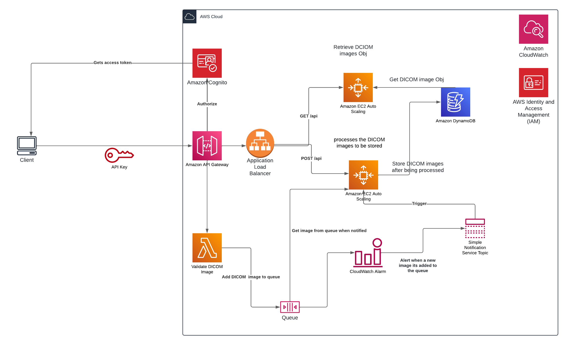
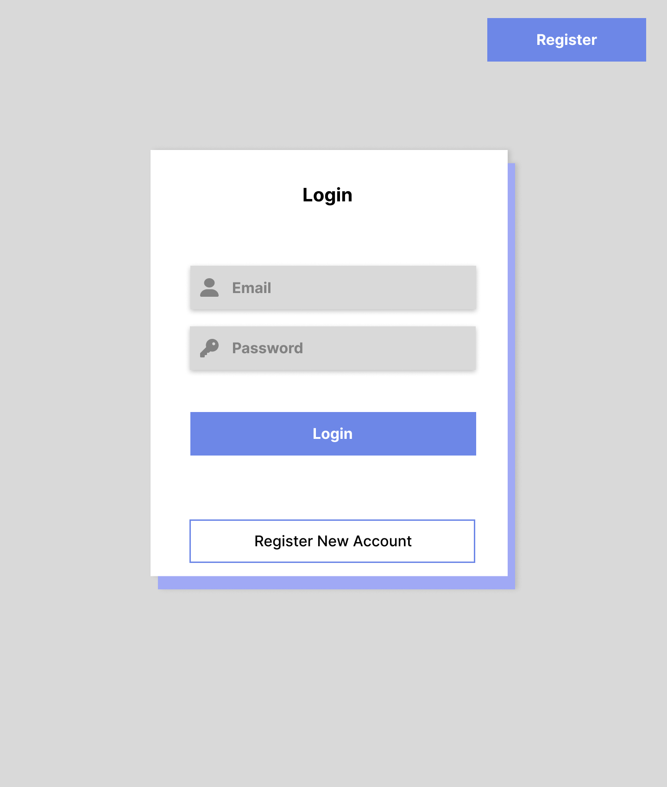
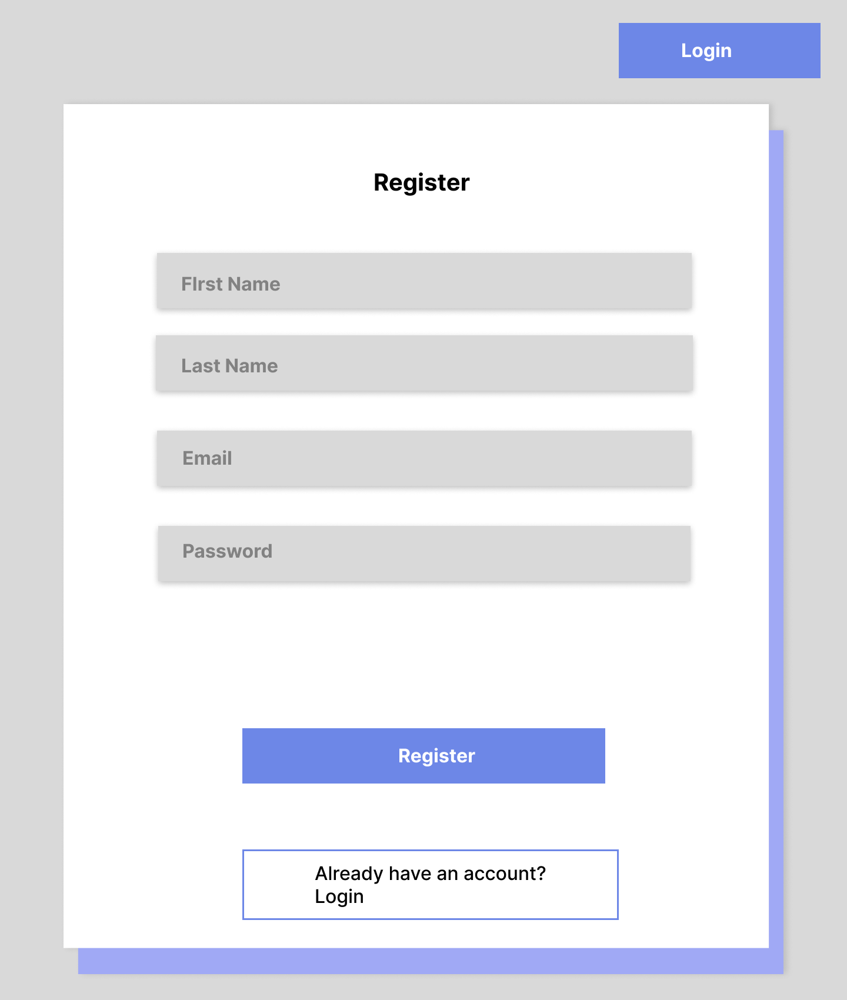
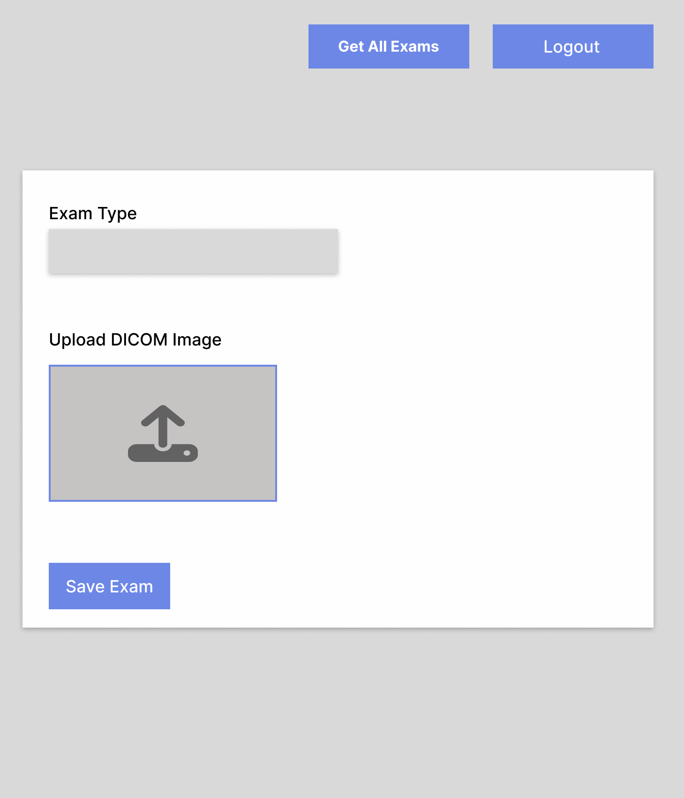
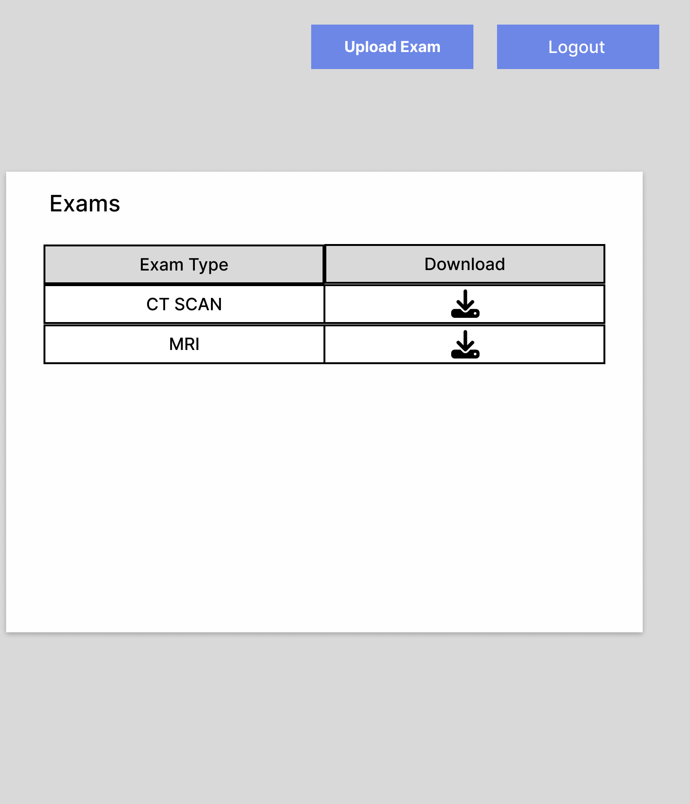

# Distributed DICOM Processing System

## Architecture Diagram

## ⚠️ DISCLAIMER ⚠️

Not much experience designing architectures

This architecture diagram represents a distributed system for processing DICOM images and the path they should follow before being stored as objects in the database. The system relies on AWS services to ensure scalability, reliability, and efficient processing of medical images

## Key Components and WorkFlow

- ### API Gateway

  This is the main entry point for clients who want to upload DICOM images. it validates the incoming files to ensure they adhere to DICOM standards.

- ### SQS Queue

  Use to store incoming DICOM Images for processing

- ### EC2 Instances

  Using an EC2 instance to store the DICOM Images or retrieve them to the client, both instances are managed by an Auto Scaling Group.

- ### DynamoDB
  Using a NoSQL database to store the processed DICOM images as objects

## Scalability and Reliability

- ### Auto Scaling

  The EC2 Auto Scaling groups automatically adjust the number of instances based on workload, ensuring optimal resource utilization

- ### Application Load Balancer (ALB)

  Distributes traffic across the EC2 instances, improving performance and fault tolerance.

- ### CloudWatch Alarms:
  Monitors the system's health and triggers actions, such as notifying when new images arrive or scaling EC2 instances when thresholds are exceeded.

## Security

- ### Amazon Cognito

  Provides user authentication and authorization, restricting access to authorized users.

- ### IAM Roles
  Assign IAM Roles to EC2 instances and Lambda functions to control their permissions and access to resources

## Monitoring and Logging:

- ### CloudWatch Metrics

Collects metrics to track system performance, including queue depth, processing time, and resource utilization.

- ### CloudWatch Logs
  Records log for troubleshooting and analysis.

---

# Frontend Design

## ⚠️ DISCLAIMER ⚠️

Not much experience designing interfaces

## Figma Design

These are simple mockups of a possible implementation of the fronted

### Login

### Register

### Save Exam

### List Exams

You can see the Figma design by clicking on the next link

[Ver Diseño en Figma](https://www.figma.com/design/tboiZImgM7EF6xZd5MYylb/test_imexhs?node-id=0-1&t=P458rEelSlFKbCZ7-1)
